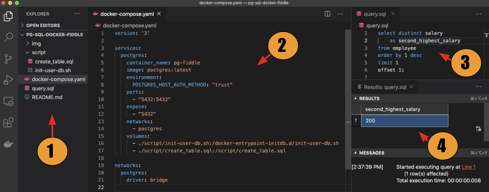

# Build your own SQL fiddle with Docker and Visual Studio Code

## Objective

To create a unified view of our data analysis environment by:

* Maximizing the mileage of your editor (we’ll be using Visual Studio Code)
* Minimizing context-switching b/t multiple tabs, windows

## Prerequisites

* [Docker](https://www.docker.com/products/docker-desktop)
* [Visual Studio Code](https://code.visualstudio.com/download)
  * [PostgreSQL extenstion](https://marketplace.visualstudio.com/items?itemName=ms-ossdata.vscode-postgresql)
  * [Docker extension](https://code.visualstudio.com/docs/containers/overview)
